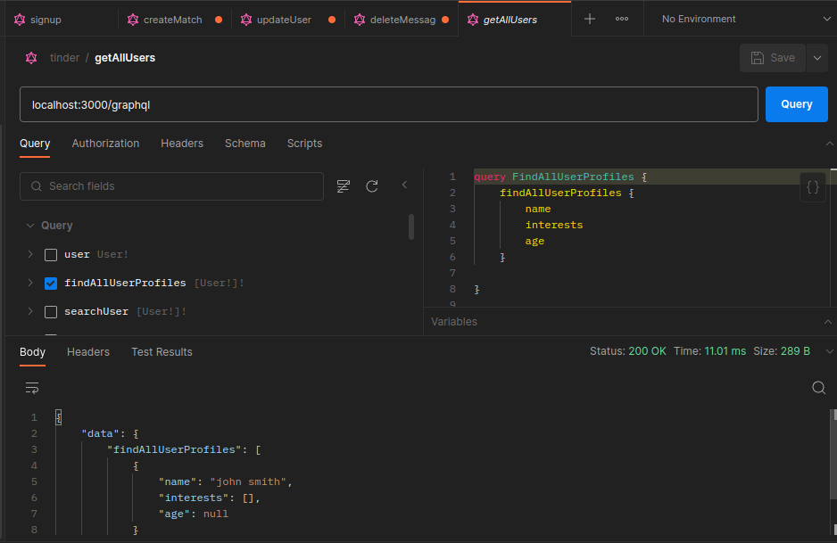

# Tinder Clone - GraphQL Back-end

This project is a GraphQL-based back-end for a Tinder clone application. It provides the necessary API for managing user accounts, profiles, matching, and messaging functionalities similar to the popular dating app Tinder.

## Features

The Tinder clone back-end offers the following features:

- User Management
  - User registration
  - User login
  - User authentication and authorization
- Profiles
  - Create and update user profiles
  - Fetch user profiles
  - Search and filter profiles based on various criteria (e.g., age, location, interests)
- Matching
  - Algorithm for matching users based on their preferences and interests
  - Accept or reject potential matches
  - Retrieve matched user profiles
- Messaging
  - Send and receive messages between matched users
  - Real-time messaging functionality
  - Notifications for new messages

## Technologies Used

The Tinder clone back-end is built using the following technologies:

- **GraphQL:** A query language for APIs, used for defining the API schema and executing queries/mutations.
- **Node.js:** A JavaScript runtime environment used for building scalable server-side applications.
- **Express.js:** A web application framework for Node.js, used for building the GraphQL server.
- **MongoDB:** A NoSQL database used for storing user data, profiles, and messages.
- **Mongoose:** An Object Data Modeling (ODM) library for MongoDB, used for modeling and interacting with the database.
- **Apollo Server:** A GraphQL server library for Node.js, used for handling GraphQL requests and responses.

## Setup and Installation

To set up and run the Tinder clone back-end locally, follow these steps:

Clone the repository:

```bash
git clone https://github.com/BaseMax/TinderGraphQLTS.git
```

Install dependencies:

```bash
cd TinderGraphQLTS
npm install
```

Configure environment variables:

- Rename the .env.example file to .env.
- Update the .env file with your own configuration, such as the database connection string and secret keys.
- Run the application:

```bash
npm start
```

This will start the GraphQL server on http://localhost:4000/graphql.

You can now send GraphQL queries and mutations to the server using a tool like GraphQL Playground or Insomnia. Open the respective tool and access http://localhost:4000/graphql to begin interacting with the API.

## GraphQL Demo





## GraphQL

### Queries

- getUser(id: ID!): User

Fetches a user by their unique identifier.

- getProfile(userId: ID!): Profile

Retrieves the profile associated with a specific user.

- getPotentialMatches(userId: ID!): [Profile]

Retrieves a list of potential matches for a user based on their preferences and interests.

- getMatches(userId: ID!): [Profile]

Retrieves a list of matched user profiles for a given user.

- getMessages(userId: ID!, matchId: ID!): [Message]

Retrieves a list of messages exchanged between a user and their matched user.

- getLikedProfiles(userId: ID!): [Profile]

Retrieves a list of profiles that a user has liked.

- getDislikedProfiles(userId: ID!): [Profile]

Retrieves a list of profiles that a user has disliked.

- getMatchedProfiles(userId: ID!): [Profile]

Retrieves a list of profiles that have been mutually matched with a user.

- getConversation(userId: ID!, matchId: ID!): Conversation

Retrieves the conversation history between a user and a specific match.

- getConversations(userId: ID!): [Conversation]

Retrieves a list of conversations that a user is currently engaged in.

### Mutations

- registerUser(input: RegisterInput!): User

Registers a new user with the provided user details.

- loginUser(email: String!, password: String!): AuthPayload

Authenticates a user with the provided email and password, returning an authentication token.

- updateProfile(userId: ID!, input: UpdateProfileInput!): Profile

Updates the profile information for a given user.

- swipeLeft(userId: ID!, potentialMatchId: ID!): Match

Marks a potential match as rejected by a user.

- swipeRight(userId: ID!, potentialMatchId: ID!): Match

Marks a potential match as accepted by a user.

- sendMessage(senderId: ID!, receiverId: ID!, message: String!): Message

Sends a message from the sender to the receiver.

- likeProfile(userId: ID!, profileId: ID!): Like

Records that a user has liked a specific profile.

- dislikeProfile(userId: ID!, profileId: ID!): Dislike

Records that a user has disliked a specific profile.

- unlikeProfile(userId: ID!, profileId: ID!): Like

Removes the like status for a user on a specific profile.

- unmatch(userId: ID!, matchId: ID!): Match

Unmatches two users, ending the match connection between them.

- deleteConversation(userId: ID!, matchId: ID!): Boolean

Deletes the conversation history between a user and a specific match.

- updateMessageReadStatus(messageId: ID!): Message

Updates the read status of a specific message to mark it as read.

## GraphQL Types

```graphql
type User {
  id: ID!
  name: String!
  email: String!
  createdAt: DateTime!
  updatedAt: DateTime!
}

type Profile {
  id: ID!
  userId: ID!
  bio: String
  age: Int
  gender: Gender
  location: String
  interests: [String]
  createdAt: DateTime!
  updatedAt: DateTime!
}

type AuthPayload {
  token: String!
  user: User!
}

type Match {
  id: ID!
  user1: User!
  user2: User!
  createdAt: DateTime!
  updatedAt: DateTime!
}

type Like {
  id: ID!
  user: User!
  profile: Profile!
  createdAt: DateTime!
  updatedAt: DateTime!
}

type Dislike {
  id: ID!
  user: User!
  profile: Profile!
  createdAt: DateTime!
  updatedAt: DateTime!
}

type Conversation {
  id: ID!
  user1: User!
  user2: User!
  messages: [Message]
  createdAt: DateTime!
  updatedAt: DateTime!
}

type Message {
  id: ID!
  conversationId: ID!
  sender: User!
  receiver: User!
  content: String!
  createdAt: DateTime!
  updatedAt: DateTime!
}

enum Gender {
  MALE
  FEMALE
  OTHER
}

scalar DateTime

type Block {
  id: ID!
  user: User!
  blockedUser: User!
  createdAt: DateTime!
  updatedAt: DateTime!
}

type Subscription {
  newMatch(userId: ID!): Match
  newMessage(conversationId: ID!): Message
}

input RegisterInput {
  name: String!
  email: String!
  password: String!
}

input UpdateProfileInput {
  bio: String
  age: Int
  gender: Gender
  location: String
  interests: [String]
}

type Notification {
  id: ID!
  userId: ID!
  message: String!
  createdAt: DateTime!
  updatedAt: DateTime!
}

input UpdateUserInput {
  name: String
  email: String
  password: String
}


type Query {
  getUser(id: ID!): User
  getProfile(userId: ID!): Profile
  getPotentialMatches(userId: ID!): [Profile]
  getMatches(userId: ID!): [Profile]
  getMessages(userId: ID!, matchId: ID!): [Message]
  getLikedProfiles(userId: ID!): [Profile]
  getDislikedProfiles(userId: ID!): [Profile]
  getMatchedProfiles(userId: ID!): [Profile]
  getConversation(userId: ID!, matchId: ID!): Conversation
  getConversations(userId: ID!): [Conversation]

  getBlocks(userId: ID!): [Block]
  getNotifications(userId: ID!): [Notification]
}

type Mutation {
  registerUser(input: RegisterInput!): User
  loginUser(email: String!, password: String!): AuthPayload
  updateProfile(userId: ID!, input: UpdateProfileInput!): Profile
  swipeLeft(userId: ID!, potentialMatchId: ID!): Match
  swipeRight(userId: ID!, potentialMatchId: ID!): Match
  sendMessage(senderId: ID!, receiverId: ID!, message: String!): Message
  likeProfile(userId: ID!, profileId: ID!): Like
  dislikeProfile(userId: ID!, profileId: ID!): Dislike
  unlikeProfile(userId: ID!, profileId: ID!): Like
  unmatch(userId: ID!, matchId: ID!): Match
  deleteConversation(userId: ID!, matchId: ID!): Boolean
  updateMessageReadStatus(messageId: ID!): Message

  blockUser(userId: ID!, blockedUserId: ID!): Block
  unblockUser(userId: ID!, blockedUserId: ID!): Boolean
  updateUserName(userId: ID!, name: String!): User
  updateUserEmail(userId: ID!, email: String!): User
  updateUserPassword(userId: ID!, password: String!): User
  markNotificationAsRead(notificationId: ID!): Notification
}

type Subscription {
  // ...existing subscriptions...
  newNotification(userId: ID!): Notification
}
```

## GraphQL Examples

- getUser(id: ID!): User

```graphql
query {
  getUser(id: "123") {
    id
    name
    email
    createdAt
    updatedAt
  }
}
```

- getProfile(userId: ID!): Profile

```graphql
query {
  getProfile(userId: "123") {
    id
    userId
    bio
    age
    gender
    location
    interests
    createdAt
    updatedAt
  }
}
```

getPotentialMatches(userId: ID!): [Profile]

```graphql
query {
  getPotentialMatches(userId: "123") {
    id
    userId
    bio
    age
    gender
    location
    interests
    createdAt
    updatedAt
  }
}
```

getMatches(userId: ID!): [Profile]

```graphql
query {
  getMatches(userId: "123") {
    id
    userId
    bio
    age
    gender
    location
    interests
    createdAt
    updatedAt
  }
}
```

getMessages(userId: ID!, matchId: ID!): [Message]

```graphql
query {
  getMessages(userId: "123", matchId: "456") {
    id
    conversationId
    sender {
      id
      name
      email
    }
    receiver {
      id
      name
      email
    }
    content
    createdAt
    updatedAt
  }
}
```

## Mutation Examples

- registerUser(input: RegisterInput!): User

```graphql
mutation {
  registerUser(input: { name: "John Doe", email: "john@example.com", password: "password" }) {
    id
    name
    email
    createdAt
    updatedAt
  }
}
```

- loginUser(email: String!, password: String!): AuthPayload

```graphql
mutation {
  loginUser(email: "john@example.com", password: "password") {
    token
    user {
      id
      name
      email
      createdAt
      updatedAt
    }
  }
}
```

- updateProfile(userId: ID!, input: UpdateProfileInput!): Profile

```graphql
mutation {
  updateProfile(userId: "123", input: { bio: "I love hiking and traveling", age: 28, gender: MALE, location: "New York" }) {
    id
    userId
    bio
    age
    gender
    location
    interests
    createdAt
    updatedAt
  }
}
```

- swipeLeft(userId: ID!, potentialMatchId: ID!): Match

```graphql
mutation {
  swipeLeft(userId: "123", potentialMatchId: "456") {
    id
    user1 {
      id
      name
      email
    }
    user2 {
      id
      name
      email
    }
    createdAt
    updatedAt
  }
}
```

- swipeRight(userId: ID!, potentialMatchId: ID!): Match

```graphql
mutation {
  swipeRight(userId: "123", potentialMatchId: "456") {
    id
    user1 {
      id
      name
      email
    }
    user2 {
      id
      name
      email
    }
    createdAt
    updatedAt
  }
}
```

- getLikedProfiles(userId: ID!): [Profile]

```graphql
query {
  getLikedProfiles(userId: "123") {
    id
    userId
    bio
    age
    gender
    location
    interests
    createdAt
    updatedAt
  }
}
```

- getDislikedProfiles(userId: ID!): [Profile]

```graphql
query {
  getDislikedProfiles(userId: "123") {
    id
    userId
    bio
    age
    gender
    location
    interests
    createdAt
    updatedAt
  }
}
```

- getMatchedProfiles(userId: ID!): [Profile]

```graphql
query {
  getMatchedProfiles(userId: "123") {
    id
    userId
    bio
    age
    gender
    location
    interests
    createdAt
    updatedAt
  }
}
```

- getConversation(userId: ID!, matchId: ID!): Conversation

```graphql
query {
  getConversation(userId: "123", matchId: "456") {
    id
    user1 {
      id
      name
      email
    }
    user2 {
      id
      name
      email
    }
    messages {
      id
      conversationId
      sender {
        id
        name
        email
      }
      receiver {
        id
        name
        email
      }
      content
      createdAt
      updatedAt
    }
    createdAt
    updatedAt
  }
}
```

- getConversations(userId: ID!): [Conversation]

```graphql
query {
  getConversations(userId: "123") {
    id
    user1 {
      id
      name
      email
    }
    user2 {
      id
      name
      email
    }
    messages {
      id
      conversationId
      sender {
        id
        name
        email
      }
      receiver {
        id
        name
        email
      }
      content
      createdAt
      updatedAt
    }
    createdAt
    updatedAt
  }
}
```

- likeProfile(userId: ID!, profileId: ID!): Like

```graphql
mutation {
  likeProfile(userId: "123", profileId: "456") {
    id
    user {
      id
      name
      email
    }
    profile {
      id
      userId
      bio
      age
      gender
      location
      interests
      createdAt
      updatedAt
    }
    createdAt
    updatedAt
  }
}
```

- dislikeProfile(userId: ID!, profileId: ID!): Dislike

```graphql
mutation {
  dislikeProfile(userId: "123", profileId: "456") {
    id
    user {
      id
      name
      email
    }
    profile {
      id
      userId
      bio
      age
      gender
      location
      interests
      createdAt
      updatedAt
    }
    createdAt
    updatedAt
  }
}
```

- unlikeProfile(userId: ID!, profileId: ID!): Like

```graphql
mutation {
  unlikeProfile(userId: "123", profileId: "456") {
    id
    user {
      id
      name
      email
    }
    profile {
      id
      userId
      bio
      age
      gender
      location
      interests
      createdAt
      updatedAt
    }
    createdAt
    updatedAt
  }
}
```

- unmatch(userId: ID!, matchId: ID!): Match

```graphql
mutation {
  unmatch(userId: "123", matchId: "456") {
    id
    user1 {
      id
      name
      email
    }
    user2 {
      id
      name
      email
    }
    createdAt
    updatedAt
  }
}
```

- deleteConversation(userId: ID!, matchId: ID!): Boolean

```graphql
mutation {
  deleteConversation(userId: "123", matchId: "456")
}
```

- updateMessageReadStatus(messageId: ID!): Message

```graphql
mutation {
  updateMessageReadStatus(messageId: "789") {
    id
    conversationId
    sender {
      id
      name
      email
    }
    receiver {
      id
      name
      email
    }
    content
    createdAt
    updatedAt
  }
}
```

- getBlocks(userId: ID!): [Block]

```graphql
query {
  getBlocks(userId: "123") {
    id
    user {
      id
      name
      email
    }
    blockedUser {
      id
      name
      email
    }
    createdAt
    updatedAt
  }
}
```

- getNotifications(userId: ID!): [Notification]

```graphql
query {
  getNotifications(userId: "123") {
    id
    userId
    message
    createdAt
    updatedAt
  }
}
```

- blockUser(userId: ID!, blockedUserId: ID!): Block

```graphql
mutation {
  blockUser(userId: "123", blockedUserId: "456") {
    id
    user {
      id
      name
      email
    }
    blockedUser {
      id
      name
      email
    }
    createdAt
    updatedAt
  }
}
```

- unblockUser(userId: ID!, blockedUserId: ID!): Boolean

```graphql
mutation {
  unblockUser(userId: "123", blockedUserId: "456")
}
```

- updateUserName(userId: ID!, name: String!): User

```graphql
mutation {
  updateUserName(userId: "123", name: "John Smith") {
    id
    name
    email
    createdAt
    updatedAt
  }
}
```

- updateUserEmail(userId: ID!, email: String!): User

```graphql
mutation {
  updateUserEmail(userId: "123", email: "johnsmith@example.com") {
    id
    name
    email
    createdAt
    updatedAt
  }
}
```

- updateUserPassword(userId: ID!, password: String!): User

```graphql
mutation {
  updateUserPassword(userId: "123", password: "newpassword") {
    id
    name
    email
    createdAt
    updatedAt
  }
}
```

- markNotificationAsRead(notificationId: ID!): Notification

```graphql
mutation {
  markNotificationAsRead(notificationId: "789") {
    id
    userId
    message
    createdAt
    updatedAt
  }
}
```

- getUser(id: ID!): User

```graphql
query {
  getUser(id: "123") {
    id
    name
    email
    createdAt
    updatedAt
  }
}
```

- getProfile(userId: ID!): Profile

```graphql
query {
  getProfile(userId: "123") {
    id
    userId
    bio
    age
    gender
    location
    interests
    createdAt
    updatedAt
  }
}
```

- getPotentialMatches(userId: ID!): [Profile]

```graphql
query {
  getPotentialMatches(userId: "123") {
    id
    userId
    bio
    age
    gender
    location
    interests
    createdAt
    updatedAt
  }
}
```

- getMatches(userId: ID!): [Profile]

```graphql
query {
  getMatches(userId: "123") {
    id
    userId
    bio
    age
    gender
    location
    interests
    createdAt
    updatedAt
  }
}
```

- getMessages(userId: ID!, matchId: ID!): [Message]

```graphql
query {
  getMessages(userId: "123", matchId: "456") {
    id
    conversationId
    sender {
      id
      name
      email
    }
    receiver {
      id
      name
      email
    }
    content
    createdAt
    updatedAt
  }
}
```

- registerUser(input: RegisterInput!): User

```graphql
mutation {
  registerUser(input: { name: "John Doe", email: "john@example.com", password: "password" }) {
    id
    name
    email
    createdAt
    updatedAt
  }
}
```

- loginUser(email: String!, password: String!): AuthPayload

```graphql
mutation {
  loginUser(email: "john@example.com", password: "password") {
    token
    user {
      id
      name
      email
      createdAt
      updatedAt
    }
  }
}
```

- updateProfile(userId: ID!, input: UpdateProfileInput!): Profile

```graphql
mutation {
  updateProfile(userId: "123", input: { bio: "I love hiking and traveling", age: 28, gender: MALE, location: "New York" }) {
    id
    userId
    bio
    age
    gender
    location
    interests
    createdAt
    updatedAt
  }
}
```

- swipeLeft(userId: ID!, potentialMatchId: ID!): Match

```graphql
mutation {
  swipeLeft(userId: "123", potentialMatchId: "456") {
    id
    user1 {
      id
      name
      email
    }
    user2 {
      id
      name
      email
    }
    createdAt
    updatedAt
  }
}
```

- swipeRight(userId: ID!, potentialMatchId: ID!): Match

```graphql
mutation {
  swipeRight(userId: "123", potentialMatchId: "456") {
    id
    user1 {
      id
      name
      email
    }
    user2 {
      id
      name
      email
    }
    createdAt
    updatedAt
  }
}
```

These examples provide further demonstrations of how to use the remaining queries and mutations in your Tinder clone application. Customize the input values as needed for testing and adapt them to suit your specific data and implementation requirements.

Feel free to customize the input values according to your specific use cases. These examples showcase the usage of additional queries and mutations related to blocking users, updating user information, and handling notifications in your Tinder clone application.

## Documentation

For detailed documentation on the available queries, mutations, and data structures, refer to the API documentation.

## Contributing

Contributions are welcome! If you find any issues or would like to suggest enhancements, please open an issue or submit a pull request.

## License

The Tinder clone back-end is open-source and released under the GPL-3.0 License.

## Acknowledgements

This project is inspired by Tinder and aims to replicate some of its functionality. It is not affiliated with or endorsed by Tinder.

Copyright 2023, Max Base
